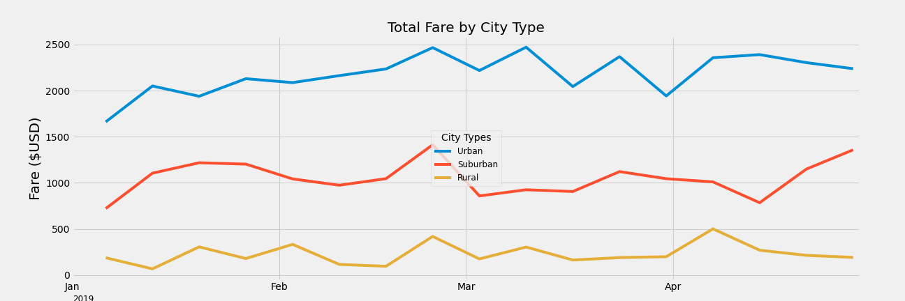

# PyBer_Challenge
Challenge Module 5 Boot Camp

## Overview of the PyBer data analisys:
The FiBer company wants to know the behavior of the customers rides in different types of cities for create wisdom for making the right decision

In a previous analysis the results shows that:  

### Scatter plot Total rides with averange fare by type of city 

- The rural cities has the higher ride fares $34.62
- The urban cities has the lower ride fares $24.53
- The rural cities has the lower number of rides 18
- The urban cities has the higher number of rides 66 

### Summary by type of city

Now the company requires make an analysis for type of city for the lapse of 1st January 2017 to 29th April 2017 

## Results

### Liner plot Total rides with averange fare by type of city by month

    * I make a change in the legends box, just because seems easy to read the urban line first.

- The line plot shows that in mostly in the time the demand behaves the same regardless of the type of city. Except in March, in this month the urban citys has a changes.
- The urban city and the suburban cities start the year with a rise in their prices
- All the types of cities have a rise by the end of March

_________________________________

 ##  Summary business recommendations for addressing any disparities among the city types.

1. Carry out marketing campaigns to generate greater demands.

    The averanges about rides count by city are:

        - Urban: 24
        - Suburban : 17
        - Rural : 6

    ### Summary rides count by city
    

    The ratios about rides vs drivers are: 

    - Urban: 0.67
    - Suburban : 1.2
    - Rural : 1.6 

    It's possible that the urban drivers didn't have a trip in the period from January to May. This behavior is almost equal in suburban and rural cities, with different ratios.

    It is essential to **carry out marketing campaigns to generate greater demands** for change, the ratio of trips vs. drivers, and generate a greater profit from drivers.

2. Human resources management with projection in future demand

    In urban cities, demand exceeds supply, this makes fare travel cheaper. The opposite happened in rural cities. It's recommendable to have the correct number of drivers per city.

    Managing human resources must meet the system's strategic needs. A future demand projection must be carried out to calculate the correct number of drivers.

### Liner plot Total rides by date

3. Create universal KPI to measure 

    The nature of each type of city creates micro markets. For urban cities, the movement is greater than that of a rural-type city. It is necessary to create KPI that apply to all types of cities, it could be travel vs. population.

